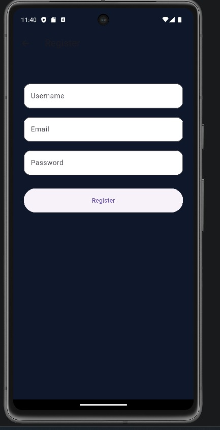
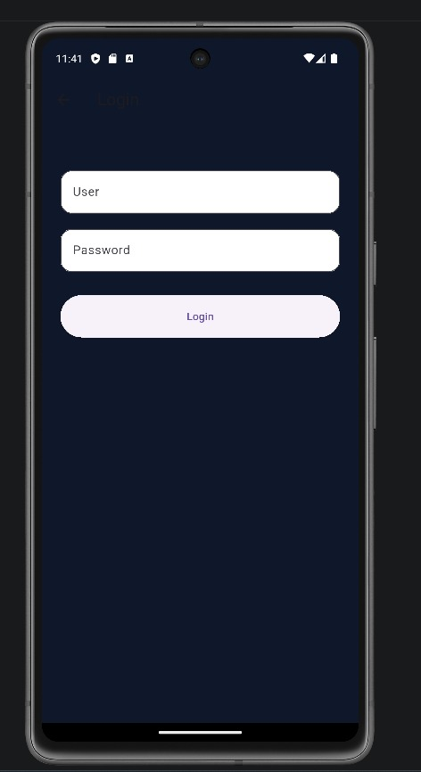
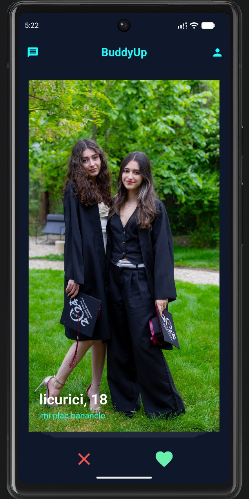
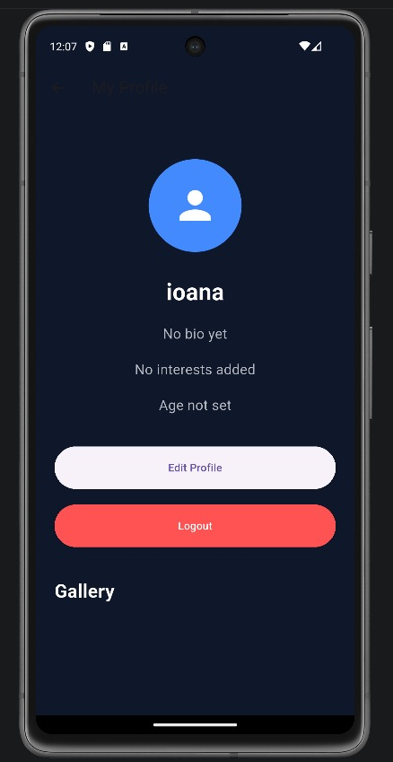
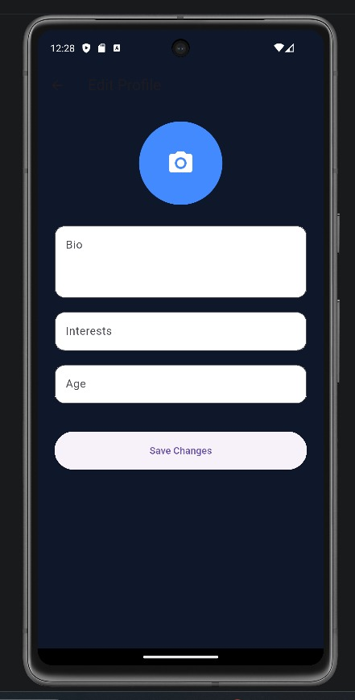
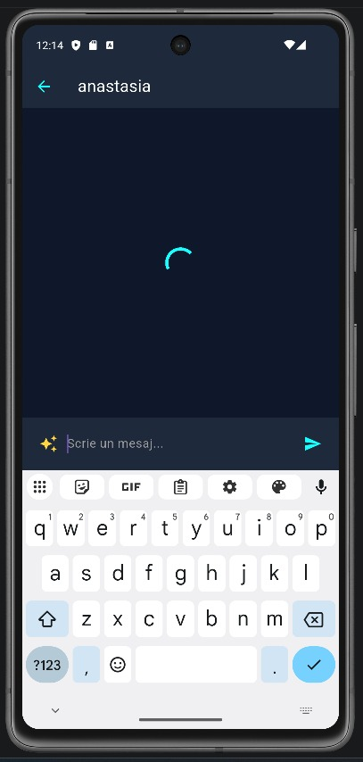

# BuddyUp! - Social Matching Application

[cite_start]BuddyUp este o aplicație mobilă de tip social matching, dezvoltată folosind tehnologiile Flutter și Django REST Framework[cite: 7]. [cite_start]Scopul aplicației este de a facilita interacțiunea dintre utilizatori prin intermediul unui sistem de profiluri, swipe-uri și match-uri[cite: 8].

## Prezentare Vizuală (Screenshots)

| Register | Login | Home (Swipe) |
| :---: | :---: | :---: |
|  |  |  |

| Profile | Edit Profile | Chat |
| :---: | :---: | :---: |
|  |  |  |

---

## Funcționalități Implementate

### Sistem de Înregistrare și Autentificare
* [cite_start]**Creare Cont:** Permite utilizatorilor să își creeze conturi noi folosind un username și o parolă[cite: 163, 172].
* [cite_start]**Securitate:** Parolele sunt securizate automat folosind sistemul de hashing oferit de Django[cite: 179].
* [cite_start]**Validare:** Backend-ul verifică unicitatea username-ului și validează datele introduse[cite: 178, 195].
* [cite_start]**Comunicare:** Schimbul de date se realizează prin endpoint-uri REST în format JSON[cite: 185].

### Sistemul de Profil
* [cite_start]**Personalizare:** Utilizatorii pot adăuga biografia, interesele și vârsta[cite: 221, 234].
* [cite_start]**Management Media:** Încărcarea pozei de profil și a unei galerii de imagini folosind pachetul `image_picker`[cite: 226, 228, 292].
* [cite_start]**Localizare:** Stocarea coordonatelor geografice (latitudine și longitudine) pentru funcții de proximitate[cite: 236, 237].

### Interacțiune și Social Matching
* [cite_start]**Sistem Swipe:** Permite utilizatorilor să ofere Like sau Pass altor profiluri[cite: 18, 52].
* [cite_start]**Generare Match:** În cazul în care doi utilizatori își oferă reciproc Like, aplicația generează automat un match[cite: 10, 61].
* [cite_start]**Vizualizare:** Posibilitatea de a vedea profilurile detaliate ale altor utilizatori înainte de a decide[cite: 19, 45].

---

## Specificații Tehnice

### Frontend (Flutter)
* [cite_start]**Interfață:** Construită dinamic folosind widget-uri precum `GridView`, `CircleAvatar` și `Image.network`[cite: 280, 281, 282, 283].
* [cite_start]**Networking:** Utilizarea pachetului `http` pentru cereri de tip multipart și REST[cite: 205, 295].
* [cite_start]**Compatibilitate:** Implementarea conversiilor de adrese IP (10.0.2.2) pentru testarea pe emulatorul Android[cite: 305, 306].

### Backend (Django)
* [cite_start]**REST API:** Dezvoltat cu Django REST Framework, utilizând `MultiPartParser` și `FormParser`[cite: 166, 254, 255].
* [cite_start]**Stocare Media:** Imaginile sunt salvate pe server și accesate prin URL-uri absolute[cite: 256, 257].

---

## Echipa de Dezvoltare
* [cite_start]Vișan Laura-Mihaela [cite: 2]
* [cite_start]Pîrvulescu Maria-Eliza [cite: 2]
* [cite_start]Țigănilă Ștefania [cite: 2]

[cite_start]*Proiect realizat pentru disciplina Metode de Dezvoltare Software.* [cite: 1]