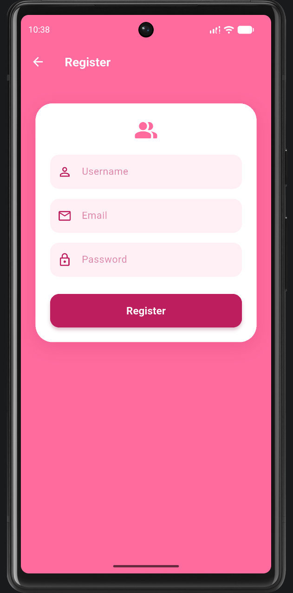
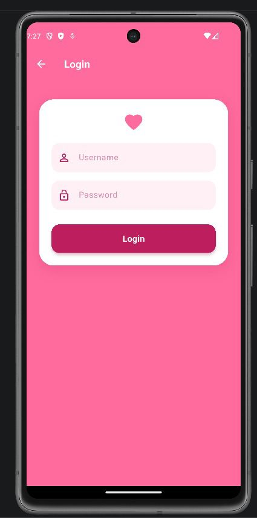
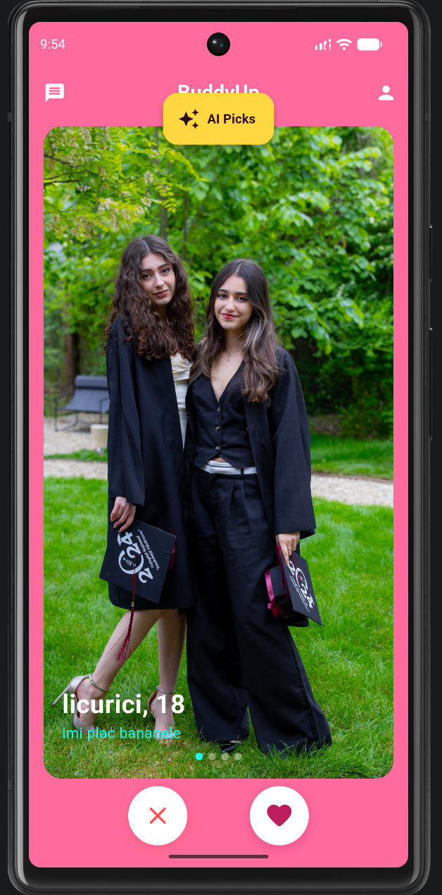
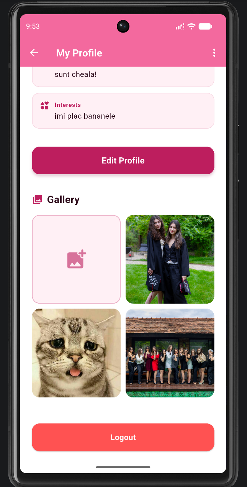
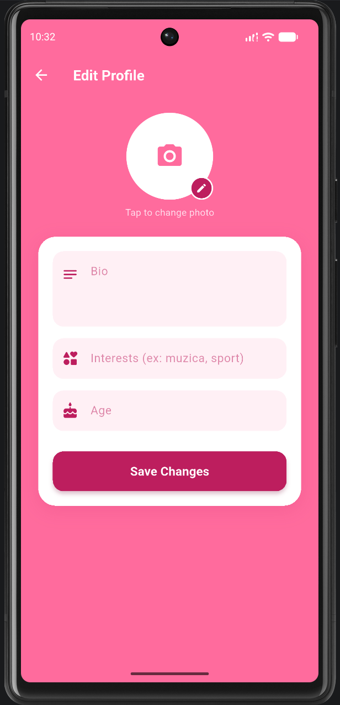
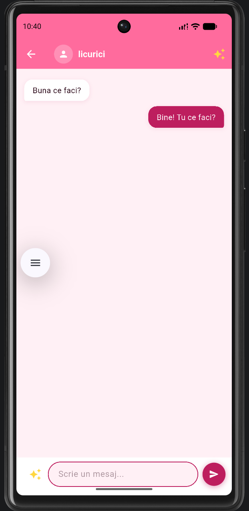

# BuddyUp! - Social Matching Application

BuddyUp este o aplicație mobilă de tip *social matching* avansată, aflată în fază activă de dezvoltare, concepută pentru a facilita conexiuni autentice între utilizatori pe baza intereselor comune și a proximității geografice. Spre deosebire de aplicațiile clasice, BuddyUp pune accent pe crearea de comunități și prietenii bazate pe pasiuni similare.

Proiectul adoptă o arhitectură modernă client-server, utilizând **Flutter** pentru o experiență de utilizator fluidă pe mobil și **Django REST Framework (DRF)** pentru un backend robust, scalabil și securizat.

---

##  Prezentare Vizuală (Screenshots Interfață)

Interfața aplicației este concepută urmând principiile *Material Design 3*, oferind un aspect curat, intuitiv și modern, cu suport pentru teme personalizate.

| Flux Înregistrare | Flux Autentificare | Ecran Principal (Swipe) |
| :---: | :---: | :---: |
|  |  |  |
| *Interfața de creare cont, cu validare în timp real.* | *Ecran securizat de login.* | *Sistemul de carduri swipable pentru descoperirea utilizatorilor.* |

| Profil Utilizator | Editare Profil | Vizualizare Chat |
| :---: | :---: | :---: |
|  |  |  |
| *Afișarea detaliată a biografiei, intereselor și galeriei.* | *Interfața pentru actualizarea datelor personale și media.* | *Sistemul de mesagerie în timp real (concept).* |

---

## Funcționalități Detaliate & Logica de Business

### 1. Sistem Avansat de Securitate și Autentificare
* **Creare Cont (Register):** Utilizatorii își pot crea un cont unic furnizând un username, email și o parolă puternică.
* **Securizarea Datelor la Nivel de Backend:** Baza de date Django nu stochează niciodată parolele în clar. Acestea sunt convertite instantaneu în *hash*-uri nereversibile folosind algoritmul **PBKDF2** cu **SHA256**, un standard în industrie.
* **Validare RESTful:** Toate datele introduse sunt validate atât pe frontend (pentru UX), cât și pe backend (pentru securitate). Endpoint-urile API verifică unicitatea email-ului și a username-ului, returnând erori standardizate în format JSON.

### 2. Managementul Profilului, Media și Interese
* **Profil Complet:** Fiecare utilizator deține un profil personalizabil ce include: biografie (bio), vârstă (validată), gen și o listă de interese.
* **Taxonomie Interese:** Interesele sunt selectate dintr-o listă predefinită gestionată pe server, asigurând o consistență în algoritmul de *matching*.
* **Management Media Multipart:** Utilizatorii pot încărca o poză principală de profil și mai multe imagini în galeria personală. Acest lucru este realizat prin cereri HTTP de tip `multipart/form-data`, gestionate eficient de Django.

### 3. Sistemul de Localizare GPS & Proximitate (Deep Dive)
Aceasta este o funcționalitate cheie a BuddyUp, concepută pentru a aduce utilizatorii online în lumea reală.

#### A. Fluxul Tehnic de Funcționare:
1.  **Activare & Permisiuni (Flutter):** La prima pornire sau la accesarea ecranului de Swipe, aplicația solicită permisiunea de a accesa locația dispozitivului.
2.  **Preluarea Coordonatelor (geolocator):** Flutter utilizează pachetul `geolocator` pentru a obține coordonatele GPS exacte (latitudine și longitudine) de la sistemul de operare al telefonului (Android/iOS).
3.  **Sincronizare cu Backend (API):** Flutter trimite aceste coordonate printr-o cerere POST către endpoint-ul API `update-location/`.
4.  **Stocare în Bază de Date (Django):** Modelul `Profile` din Django actualizează câmpurile `latitude` și `longitude` pentru utilizatorul respectiv.

#### B. Permisiuni NecesarE:
Aplicația solicită permisiuni specifice pentru a funcționa corect:
* **Android:**
    * `ACCESS_FINE_LOCATION` (pentru locație precisă GPS).
    * `ACCESS_COARSE_LOCATION` (pentru locație aproximativă prin rețea).
* **iOS:**
    * `NSLocationWhenInUseUsageDescription` (pentru a accesa locația doar când aplicația este deschisă).

#### C. Integrare în Interfață (UI):
Deși în această fază locația este doar stocată, arhitectura este pregătită pentru a afișa distanța (ex: *"la 5km distanță"* concept) direct pe cardurile de swipe, folosind calcule matematice de distanță pe sferă (formula Haversine) direct în backend.

### 4. Algoritmul de Social Matching (Swipe & Match Logic)

#### A. Mecanica Swipe (LIKE/PASS):
Ecranul principal folosește o interfață bazată pe carduri (pachetul `flutter_card_swiper`).
* **Swipe Dreapta (LIKE):** Înregistrează o intenție pozitivă.
* **Swipe Stânga (PASS):** Înregistrează o intenție neutră/negativă.
* Backend-ul stochează aceste interacțiuni în tabelul `Swipe`, asigurându-se că un utilizator nu primește swipe de două ori de la aceeași persoană.

#### B. Generarea Automată a Match-urilor (Reciprocitate):
Atunci când backend-ul primește un swipe de tip 'LIKE', rulează instantaneu un *trigger*:
* Verifică dacă există deja un LIKE înregistrat în baza de date de la utilizatorul primit spre utilizatorul sursă.
* Dacă ambele LIKE-uri există (reciprocitate), sistemul creează automat o intrare în tabelul `Match`.

#### C. Filtrarea Profilurilor bazată pe Interese Comune (Logica de Descoperire):
Utilizatorii afișați în ecranul de Swipe nu sunt aleși aleatoriu. Endpoint-ul API `/swipes/api/get-utilizatori-filtrati/` implementează un algoritm de filtrare complex:
1.  **Excludere Sine:** Utilizatorul curent nu se va vedea niciodată pe sine.
2.  **Excludere Match-uri:** Utilizatorii cu care ești deja într-un match sunt ascunși.
3.  **Filtrare Interese (Nucleul):** Django analizează lista de interese a utilizatorului curent și returnează doar profilurile utilizatorilor care **împărtășesc cel puțin un interes comun**. Aceasta asigură că swiping-ul este relevant și bazat pe pasiuni similare, nu doar pe aspect.

---

## Arhitectură Tehnică & Arborescență

### Stack Tehnologic
* **Frontend Mobile:** Flutter (Dart), folosind pachete cheie precum `http`, `image_picker`, `flutter_card_swiper`, `geolocator`.
* **Backend API:** Django, Django REST Framework (Python), gestionând autentificarea, baza de date, media și logica de matching.

### Arborescență Proiect (Structură Simplificată)

🛠️ Ghid de Dezvoltare și Testare Locală
Acest proiect necesită rularea simultană a două servere (Backend și Frontend).

Cerințe Instalare
Python 3.10+

Flutter SDK (ultima versiune stabilă)

Android Studio / Xcode (pentru emulator)

1. Configurarea Backend-ului (Django)
Bash
# Intră în folderul de backend
cd backend

# Creează un mediu virtual (opțional, recomandat)
python -m venv venv
source venv/bin/activate  # Pe Windows: venv\Scripts\activate

# Instalează dependențele (se va adăuga requirements.txt)
pip install django djangorestframework pillow geopy django-cors-headers

# Efectuează migrarea bazei de date (creează tabelele)
python manage.py migrate

# Pornește serverul de dezvoltare
python manage.py runserver 0.0.0.0:8000
Notă: Rularea pe 0.0.0.0 este crucială pentru ca emulatorul Android să poată accesa serverul local.

2. Configurarea Frontend-ului (Flutter) & Testare pe Emulator
Aceasta este o configurare specială pentru a facilita testarea pe emulatorul Android, care vede serverul local la o adressă IP diferită.

Pachetul geolocator: Asigurați-vă că fișierele de permisiuni (AndroidManifest.xml pentru Android și Info.plist pentru iOS) sunt configurate corect cu descrierile necesare, așa cum este menționat în secțiunea GPS.

Bash
# Intră în folderul aplicației Flutter
cd buddyup

# Descarcă dependențele
flutter pub get

# Pornește aplicația pe emulatorul conectat
flutter run
Emulator Testing Bridge (10.0.2.2 Magic)
Deoarece emulatorul Android rulează într-o rețea virtuală, localhost sau 127.0.0.1 de pe telefon nu este calculatorul dumneavoastră.

Flutter este configurat în serviciile sale de networking să convertească automat adresa IP a imaginilor media. Backend-ul trimite URL-uri de imagini care conțin 127.0.0.1, iar Flutter, la recepție, înlocuiește dinamic acest IP cu 10.0.2.2, care este adresa specială folosită de emulator pentru a accesa localhost-ul mașinii gazdă. Acest lucru permite încărcarea corectă a imaginilor media în aplicație în timpul dezvoltării.

👥 Echipa de Dezvoltare
Vișan Laura-Mihaela

Pîrvulescu Maria-Eliza

Țigănilă Ștefania
