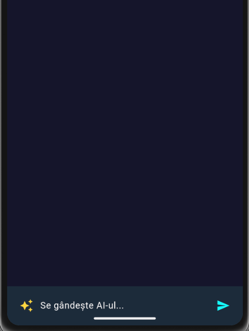

# BuddyUp — Social Matching Application

BuddyUp este o aplicație mobilă de tip *social matching* avansată, aflată în fază activă de dezvoltare, concepută pentru a facilita conexiuni autentice între utilizatori pe baza intereselor comune și a proximității geografice. Spre deosebire de aplicațiile clasice, BuddyUp pune accent pe crearea de comunități și prietenii bazate pe pasiuni similare.

Proiectul adoptă o arhitectură modernă client-server, utilizând **Flutter** pentru o experiență de utilizator fluidă pe mobil și **Django REST Framework (DRF)** pentru un backend robust, scalabil și securizat.

---

## Cuprins

1. [Prezentare generală](#prezentare-generală)
2. [Screenshots](#prezentare-vizuală-screenshots)
3. [Funcționalități](#funcționalități-detaliate--logica-de-business)
   - [Autentificare & Securitate](#1-autentificare--securitate)
   - [Profil, Media & Galerie](#2-profil-media--galerie)
   - [GPS & Proximitate](#3-sistemul-de-localizare-gps--proximitate)
   - [Swipe & Match](#4-algoritmul-de-social-matching-swipe--match)
   - [Chat & Mesagerie](#5-chat--mesagerie)
   - [Funcționalități AI](#6-funcționalități-ai)
   - [Siguranță: Block & Report](#7-siguranță-block--report)
4. [Arhitectură & Stack tehnic](#arhitectură-tehnică--stack)
5. [Structura proiectului](#structura-proiectului)
6. [Referință API](#referință-api)
7. [Ghid de instalare & testare locală](#-ghid-de-instalare--testare-locală)
8. [Echipa](#-echipa-de-dezvoltare)

---

## Prezentare generală

BuddyUp este o aplicație mobilă de tip *social matching* concepută pentru a facilita conexiuni autentice între utilizatori pe baza intereselor comune și a proximității geografice. Spre deosebire de aplicațiile clasice de dating, BuddyUp pune accent pe crearea de prietenii și comunități bazate pe pasiuni similare.

Proiectul adoptă o arhitectură modernă **client-server**:
- **Flutter (Dart)** — frontend mobil cu interfață fluidă pe Android și iOS
- **Django 5.x + Django REST Framework** — backend robust, scalabil, cu API RESTful

---

## Prezentare Vizuală (Screenshots)

Interfața urmează principiile *Material Design 3*, cu o temă personalizată mai girly -fundal roz, accente roz-piersică și carduri albe.

| Înregistrare | Autentificare | Ecran Principal (Swipe) |
| :---: | :---: | :---: |
|  |  |  |
| *Creare cont cu validare în timp real.* | *Ecran securizat de login cu persistență sesiune.* | *Carduri swipable cu galerie de imagini și distanță GPS.* |

| Profil | Editare Profil | Chat |
| :---: | :---: | :---: |
|  |  |  |
| *Biografie, interese, galerie foto și opțiuni de securitate.* | *Actualizare date personale și media.* | *Mesagerie în timp real cu sugestii AI Icebreaker.* |
| AI-top picks |  AI-Chat |
| :---: |  :---: |
|  |  | 
| *top-picks by ai* | *ai ul iti da sugestii de icebreakers* | 

---

## Funcționalități Detaliate & Logica de Business

### 1. Autentificare & Securitate

**Creare cont (Register)**
- Utilizatorul furnizează username, email și parolă.
- Backend-ul validează unicitatea username-ului și a email-ului, returnând erori standardizate JSON.
- Parolele nu sunt stocate niciodată în clar — Django le convertește automat în hash-uri nereversibile prin algoritmul **PBKDF2 cu SHA256**.

**Autentificare (Login)**
- La autentificare reușită, backend-ul returnează `user_id` și `username`.
- Datele sesiunii sunt salvate local pe dispozitiv cu **`SharedPreferences`**, astfel încât utilizatorul rămâne autentificat la repornirea aplicației fără a reintroduce credențialele.
- La logout, sesiunea locală este ștearsă complet.

---

### 2. Profil, Media & Galerie

**Profil complet**

Fiecare utilizator deține un profil personalizabil ce include: biografie, vârstă, interese și media (poză de profil + galerie).

**Galerie de imagini**
- Fiecare utilizator poate adăuga **maxim 6 imagini** în galeria personală.
- Imaginile sunt vizibile direct pe cardurile de swipe — utilizatorii pot naviga prin ele cu un tap pe jumătatea dreaptă/stângă a cardului.
- **Long-press** pe o imagine din galeria proprie deschide un dialog de confirmare pentru ștergere.
- Uploadul se face prin cereri HTTP `multipart/form-data`, gestionate de Django cu `Pillow`.

**Poza de profil**
- Separată de galerie, selectată din galeria telefonului prin `image_picker`.
- Stocată pe server și servită ca URL inclus în răspunsul API.

> **Notă tehnică — conversie IP emulator:** Backend-ul returnează URL-uri de media care conțin `127.0.0.1`. Flutter înlocuiește dinamic acest IP cu `10.0.2.2` (gateway-ul mașinii gazdă pentru emulatorului Android), permițând încărcarea corectă a imaginilor în timpul dezvoltării.

---

### 3. Sistemul de Localizare GPS & Proximitate

Funcționalitate cheie a BuddyUp — aduce utilizatorii online în lumea reală prin afișarea distanței față de fiecare potențial match.

#### A. Fluxul tehnic complet

```
initState()
    │
    ▼
_requestPermission()          ← verifică dacă GPS-ul e activ; solicită permisiunea
    │
    ▼
_fetchAndSendLocation()       ← timeout 8s pentru a nu bloca UI-ul
    │
    ├── getLastKnownPosition() ← instant, folosește ultima locație cachéd
    │       │ null?
    └───────▼
        getCurrentPosition(accuracy: medium)  ← fallback, 1-5 secunde
    │
    ▼
POST /swipes/api/update-location/   ← trimite { user_id, latitude, longitude }
    │
    ▼
Django → Profile.save(latitude, longitude)   ← update_fields pentru performanță
    │
    ▼
fetchPotentialMatches()
    │
    ▼
GET /swipes/api/utilizatori/?user_id=X
    │
    ▼
Django calculează distance_km cu geopy.distance.geodesic() pentru fiecare profil
    │
    ▼
Flutter afișează badge "X.X km" pe cardul fiecărui utilizator
```

#### B. Calcul distanță — formula geodezică

Distanța se calculează server-side cu **`geopy.distance.geodesic()`** — formula geodezică (distanță pe suprafața elipsoidului terestru WGS-84), mai precisă decât Haversine pentru distanțe mici și medii:

```python
from geopy.distance import geodesic

distance_km = round(
    geodesic(
        (my_lat, my_lon),
        (other_lat, other_lon)
    ).km,
    1  # rotunjit la o zecimală
)
```

Dacă oricare dintre utilizatori nu are locația salvată, câmpul `distance_km` returnează `null` și badge-ul nu este afișat pe card.

#### C. Permisiuni necesare

**Android** (`AndroidManifest.xml`):
```xml
<uses-permission android:name="android.permission.ACCESS_FINE_LOCATION"/>
<uses-permission android:name="android.permission.ACCESS_COARSE_LOCATION"/>
```

**iOS** (`Info.plist`):
```xml
<key>NSLocationWhenInUseUsageDescription</key>
<string>BuddyUp folosește locația pentru a găsi utilizatori din apropierea ta.</string>
```

---

### 4. Algoritmul de Social Matching (Swipe & Match)

#### A. Mecanica de Swipe

Ecranul principal folosește pachetul `flutter_card_swiper` cu carduri ce suportă galerie de imagini.

| Acțiune | Efect |
|---|---|
| Swipe dreapta (sau buton ❤️) | LIKE — înregistrează intenție pozitivă |
| Swipe stânga (sau buton ✕) | DISLIKE — înregistrează intenție negativă |
| Tap stânga/dreapta pe card | Navighează prin galeria de imagini |

> **Regulă critică:** Callback-ul `onSwipe` returnează întotdeauna `true`, indiferent de rezultatul apelului API. Aceasta previne blocarea animației cardului în caz de eroare de rețea.

#### B. Generarea automată a Match-urilor

Când backend-ul primește un swipe LIKE, verifică reciprocitatea instantaneu:

```python
# Există deja un LIKE invers?
reciproc = Swipe.objects.filter(
    swiper=swiped_user,
    swiped_user=swiper,
    swipe_type='RIGHT'
).exists()

if reciproc:
    # Normalizare: user1.id < user2.id → previne duplicate
    u1, u2 = (swiper, swiped_user) if swiper.id < swiped_user.id \
              else (swiped_user, swiper)
    Match.objects.get_or_create(user1=u1, user2=u2)
```

La detectarea unui match, Flutter afișează un **SnackBar animat** cu numele utilizatorului potrivit.

#### C. Fluxul Match → Chat

La formarea unui match, backend-ul creează automat un **thread de conversație** asociat perechii. Acesta apare în ecranul *Matches* cu un `thread_id` ce permite deschiderea directă a chat-ului.

---

### 5. Chat & Mesagerie

Ecranul de chat permite conversații între utilizatorii care s-au potrivit (match).

- Mesajele sunt identificate prin `sender` (username) — cele proprii apar aliniate la dreapta (fundal roz), cele primite la stânga (fundal alb).
- **Trimitere mesaj:** POST la `/chat/api/send/` cu `{ sender_id, text, thread_id }`.
- **Preluare mesaje:** GET `/chat/api/{thread_id}/messages/` la inițializarea ecranului.

---

### 6. Funcționalități AI (AI Matchmaking Engine & Icebreaker)

BuddyUp integrează un subsistem hibrid de inteligență artificială, rulat 100% local (fără API-uri externe în cloud), pentru a garanta zero costuri operaționale și confidențialitatea totală a datelor utilizatorilor.

#### A. Arhitectura Subsistemului AI
Sistemul utilizează motorul **Ollama** care rulează ca daemon local pe portul `11434`, expunând un API REST nativ pentru manipularea modelului lingvistic **Llama 3 (8B Instruct)**. Acest model a fost ales pentru capacitatea sa avansată de *Instruction Tuning* și generare de text contextual.

#### B. AI Picks (Recomandări de Compatibilitate)

Disponibil din ecranul principal. Algoritmul filtrează baza de date pentru compatibilități, apoi folosește Llama 3 pentru a genera o justificare semantică scurtă și convingătoare de ce doi utilizatori ar trebui să se conecteze.

**Fluxul de Date (Pipeline):**
1. **Profile Filtering:** Django ORM filtrează utilizatorii aplicând o mapare a seturilor de interese (`interests`).
2. **Prompt Composition:** Se construiește dinamic un prompt structurat, injectând variabilele de profil (interese, descriere bio) ale ambilor utilizatori. Se aplică constrângeri stricte de generare: forțarea limbii române, maxim 2 propoziții pentru evitarea *text-overflow* pe UI, și formatare prefixată cu emoji (✨).

**Mecanism de Fallback (Fault Tolerance):**
Pentru a asigura continuitatea UX, a fost implementat un mecanism de siguranță. Dacă inferența AI eșuează sau depășește limita de `timeout=120s` impusă în backend, sistemul comută automat pe un șablon static generat direct din datele brute din baza de date:
* *Exemplu Fallback:* `✨ Recomandare specială! Analiza AI indică compatibilitate ridicată pe baza interesului pentru: {interese_afisate}.`

#### C. AI Icebreaker
Disponibil în ecranul de chat prin butonul ✨. Generează automat un mesaj de deschidere complet personalizat pe baza profilului celuilalt utilizator.
Comportament UX: Câmpul de text afișează *"Se gândește AI-ul..."* în timpul inferenței, înlocuind apoi textul cu sugestia generată — gata de a fi trimisă sau editată de utilizator.

### 7. Siguranță și Moderare (Block & Report)

Pentru a menține o comunitate sigură, autentică și prietenoasă, BuddyUp pune la dispoziția utilizatorilor instrumente simple de moderare a propriilor interacțiuni. Aceste opțiuni pot fi accesate rapid din ecranul de profil al oricărui utilizator, prin meniul din bara de sus (AppBar).

#### A. Funcția de Blocare (Block User)
Dacă un utilizator nu mai dorește să comunice cu o anumită persoană, o poate bloca instantaneu.
* **Cum funcționează:** Utilizatorului i se afișează un scurt mesaj de confirmare pentru a preveni apăsările accidentale. Odată blocat, sistemul backend (`/reports/api/block_user/`) taie imediat legătura dintre cei doi, împiedicând orice comunicare viitoare.
* **Experiența utilizatorului:** După confirmare, utilizatorul primește o notificare vizuală de succes (SnackBar) pe un fundal roșu și este scos automat de pe profilul persoanei blocate.

#### B. Funcția de Raportare (Report User)
În cazul unui comportament inadecvat care încalcă regulile aplicației, utilizatorii pot alerta direct echipa de administrare.
* **Cum funcționează:** Selectarea acestei opțiuni deschide o fereastră (pop-up) pe ecran, conținând un câmp de text liber. Aici, utilizatorul poate detalia motivul raportării. Datele sunt trimise direct către server (`/reports/api/report_user/`) pentru a fi analizate din panoul de control secret al administratorilor.
* **Experiența utilizatorului:** Trimite raportul printr-o simplă apăsare de buton, fereastra se închide fluid, iar o notificare confirmă recepționarea cu succes a sesizării.

Aceste instrumente asigură că fiecare membru deține controlul absolut asupra propriului spațiu și asupra persoanelor cu care alege să interacționeze în comunitatea BuddyUp.

## Arhitectură Tehnică & Stack

| Nivel | Tehnologie | Rol |
|---|---|---|
| Frontend | Flutter (Dart) | UI mobil cross-platform |
| State management | `setState` + `initState` | Simplu, fără biblioteci externe |
| HTTP client | `http` | Comunicare cu API-ul REST |
| Locație GPS | `geolocator ^13.0.4` | Coordonate GPS Android/iOS |
| Media | `image_picker` | Selectare imagini din galerie |
| Swipe UI | `flutter_card_swiper` | Widget de carduri swipable |
| Persistență locală | `shared_preferences` | Sesiune utilizator persistentă |
| Backend | Django 5.x + DRF | API REST, logică de business |
| Bază de date | SQLite (dev) | Stocare date |
| Media server | Django + Pillow | Upload și servire imagini |
| Distanță | geopy | Calcul geodezic |
| Securitate | PBKDF2 + SHA256 | Hash parole |

---

## Structura proiectului

```
BuddyUp/
│
├── backend/                        # Proiect Django
│   ├── buddyup/                    # Configurație principală
│   │   ├── settings.py
│   │   ├── urls.py
│   │   └── wsgi.py
│   │
│   ├── users/                      # Autentificare
│   │   ├── models.py
│   │   └── views.py                # /users/login/, /users/register/
│   │
│   ├── profiles/                   # Profiluri & Media
│   │   ├── models.py               # Profile (bio, age, interests, lat, lon, picture)
│   │   └── views.py                # CRUD profil, upload poză, galerie
│   │
│   ├── swipes/                     # Swipe, Match, GPS, AI Picks
│   │   ├── models.py               # Swipe (swiper, swiped_user, swipe_type)
│   │   └── views.py                # inregistreaza_swipe, get_utilizatori_filtrati,
│   │                               # actualizeaza_locatia, get_ai_top_picks
│   │
│   ├── matches/                    # Listare matches
│   │   ├── models.py               # Match (user1, user2, thread_id, data_match)
│   │   └── views.py                # /matches/api/lista/
│   │
│   ├── chat/                       # Mesagerie & AI Icebreaker
│   │   ├── models.py               # Thread, Message
│   │   └── views.py                # send, messages, icebreaker
│   │
│   ├── reports/                    # Siguranță
│   │   └── views.py                # block_user, report_user
│   │
│   └── ai_features/                # Logică AI auxiliară
│
└── buddyup/                        # Proiect Flutter
    ├── pubspec.yaml
    ├── android/
    │   └── app/src/main/
    │       └── AndroidManifest.xml # Permisiuni GPS
    │
    └── lib/
        ├── main.dart
        └── screens/
            ├── welcome_screen.dart
            ├── login_screen.dart
            ├── register_screen.dart
            ├── home_screen.dart        # Swipe + GPS + AI Picks
            ├── profile_screen.dart     # Profil + Galerie + Block/Report
            ├── edit_profile_screen.dart
            ├── matches_screen.dart
            └── chat_screen.dart        # Mesaje + AI Icebreaker
```

---

## Referință API

Toate endpoint-urile sunt disponibile la `http://localhost:8000` (sau `http://10.0.2.2:8000` de pe emulatorul Android).

### Autentificare

| Metodă | Endpoint | Body / Params | Răspuns |
|---|---|---|---|
| `POST` | `/users/register/` | `{username, email, password}` | `{message}` sau `{error}` |
| `POST` | `/users/login/` | `{username, password}` | `{message, username, user_id}` |

### Profiluri & Media

| Metodă | Endpoint | Body / Params | Răspuns |
|---|---|---|---|
| `GET` | `/profiles/{user_id}/` | — | `{username, bio, age, interests, profile_picture}` |
| `PUT` | `/profiles/update/{user_id}/` | `{bio, interests, age}` | `{message}` |
| `PUT` | `/profiles/upload-picture/{user_id}/` | `multipart: profile_picture` | — |
| `GET` | `/profiles/gallery/{user_id}/` | — | `[{id, image}]` |
| `POST` | `/profiles/upload-gallery/{user_id}/` | `multipart: image` | — |
| `DELETE` | `/profiles/delete-gallery/{image_id}/` | — | `{message}` |

### Swipe, Match & Locație

| Metodă | Endpoint | Body / Params | Răspuns |
|---|---|---|---|
| `GET` | `/swipes/api/utilizatori/` | `?user_id=X` | `[{id, username, age, bio, interests, profile_picture, distance_km}]` |
| `POST` | `/swipes/api/inregistreaza/{id}/{tip}/` | `?from_user=X` · `tip`: `like`\|`dislike` | `{status, is_match, matched_with}` |
| `POST` | `/swipes/api/update-location/` | `{user_id, latitude, longitude}` | `{status: "ok"}` |
| `GET` | `/swipes/api/ai-picks/` | `?user_id=X` | `[{id, username, age, interests, ai_reason}]` |
| `GET` | `/matches/api/lista/` | `?user_id=X` | `[{username, data_match, thread_id}]` |

### Chat & Raportare

| Metodă | Endpoint | Body / Params | Răspuns |
|---|---|---|---|
| `GET` | `/chat/api/{thread_id}/messages/` | — | `{messages: [{sender, text}]}` |
| `POST` | `/chat/api/send/` | `{sender_id, text, thread_id}` | — |
| `POST` | `/chat/api/icebreaker/` | `{user_id, target_user, thread_id}` | `{suggestion}` |
| `POST` | `/reports/api/block_user/` | `{user_id, other_user_id}` | `{message}` |
| `POST` | `/reports/api/report_user/` | `{user_id, other_user_id, reason}` | `{message}` |

---

## 🛠️ Ghid de Instalare & Testare Locală

Proiectul necesită rularea simultană a două servere — Backend Django și Frontend Flutter.

### Cerințe

- Python **3.10+**
- Flutter SDK (ultima versiune stabilă)
- Android Studio (pentru emulatorul Android) sau Xcode (pentru iOS)
- Git

---

### 1. Backend Django

```bash
# Clonează repository-ul
git clone https://github.com/username/buddyup.git
cd buddyup/backend

# (Recomandat) Crează un mediu virtual
python -m venv venv
# Windows:
venv\Scripts\activate
# macOS/Linux:
source venv/bin/activate

# Instalează dependențele
pip install -r requirements.txt
# Sau manual:
pip install django djangorestframework pillow geopy django-cors-headers

# Aplică migrările (creează tabelele în baza de date)
python manage.py migrate

# Pornește serverul
python manage.py runserver 0.0.0.0:8000
```

> **Important:** Serverul trebuie pornit pe `0.0.0.0:8000` (nu `127.0.0.1`), altfel emulatorul Android nu îl poate accesa.

---

### 2. Frontend Flutter

```bash
cd buddyup/

# Descarcă dependențele
flutter pub get

# Verifică că un emulator Android este pornit
flutter devices

# Pornește aplicația
flutter run
```

#### Configurare permisiuni GPS (dacă nu sunt deja setate)

**`android/app/src/main/AndroidManifest.xml`** — adaugă înainte de `<application>`:
```xml
<uses-permission android:name="android.permission.ACCESS_FINE_LOCATION"/>
<uses-permission android:name="android.permission.ACCESS_COARSE_LOCATION"/>
```

---

### Testare pe emulator Android — bridge `10.0.2.2`

Emulatorul Android rulează într-o rețea virtuală izolată. Adresa `localhost` sau `127.0.0.1` de pe emulator **nu** reprezintă calculatorul gazdă.

| Adresă | Context |
|---|---|
| `127.0.0.1` | Localhost-ul emulatorului însuși |
| `10.0.2.2` | Mașina gazdă (calculatorul tău) — unde rulează Django |

Toate apelurile API din Flutter folosesc `http://10.0.2.2:8000`. URL-urile de imagini returnate de Django (care conțin `127.0.0.1`) sunt convertite dinamic în Flutter la recepție.

---

## 👥 Echipa de Dezvoltare

| Nume | Responsabilitate principală |
|---|---|
| **Vișan Laura-Mihaela** | Module `users`, `profiles` — autentificare, înregistrare utilizatori, persistență sesiune (SharedPreferences), gestionare profil, editare date personale, încărcare și ștergere poze de profil/galerie|
| **Pîrvulescu Maria-Eliza** | Arhitectură generală, `swipes`, `matches`, GPS, integrare client-server, infrastructură |
| **Țigănilă Ștefania** | Module `reports`, `ai_features`, `chat` — siguranță, funcționalități AI |

---

*BuddyUp — Proiect realizat în cadrul cursului Metode de Dezvoltare Software, 2026*
